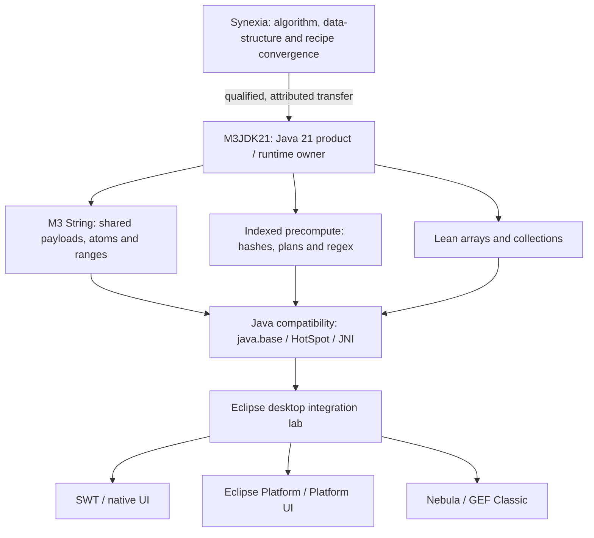

# M³ JDK 21

### Share structure. Reuse computation. Prove the result.

**A Java 21 runtime research and engineering programme**  
M3 String · Regex and precompute · Lean collections · JNI/native boundaries · SWT / Eclipse

**[Start here](#start-here)** · **[Architecture](#architecture-at-a-glance)** · **[Eclipse ecosystem](#the-eclipse-desktop-lab)** · **[Open invitation](#an-open-technical-invitation)** · **[Roadmap](#project-goals-and-plan)**

> [!IMPORTANT]
> **A laboratory, not a marketing benchmark.** M3JDK21 is an OpenJDK-derived experimental Java 21 product/runtime tree. Design targets, branches, and candidate optimizations are **not** proof of compatibility, release readiness, or faster execution. Only reproducible builds, regression results, and measured comparisons qualify a claim. Upstream licenses and the [M3/Synexia provenance boundary](M3-SYNEXIA-NOTICE.md) remain authoritative.

## Start here

**The problem:** modern Java workloads repeatedly scan, copy, allocate, hash, parse, and reconstruct information that may already have a safe reusable representation.

**The idea:** canonical immutable payloads, ranges, atoms, compositions, indexed sidecars, and prepared execution plans can let the runtime **do work once and reuse the result**—when their construction, retention, and synchronization costs justify it.

**The rule:** optimize nothing by breaking Java semantics. Equality, ordering, Unicode, concurrency, lifecycle, native interfaces, reflection, and public contracts remain part of the proof.

| Follow the engineering | Open the source or evidence |
| --- | --- |
| **M3 String** — canonical text, views and compositions; String/JNI integration target | [M3 String migration and lineage](m3/docs/m3string-synexia-lineage.md) · [String porting invariant](m3/docs/M3JDK21_PORTING_INVARIANT.md) |
| **Regex and precompute** — planned reusable indexes, caches and bounded metadata | [Regex and text contracts](m3/docs/string-text-replacement-spec.md) · [Compatibility/benchmark spec](m3/release/BENCHMARK_AND_COMPATIBILITY_SPEC.md) |
| **Collections and arrays** — lean storage, indexed signals and mechanical improvement | [Collections workstream](m3/collections/) · [Array workstream](m3/arrays/) |
| **Recipes and convergence** — reusable transformations, source mapping and acceptance gates | [Recipes](m3/recipes/) · [Synexia model](m3/docs/SYNEXIA_CONVERGENCE_MODEL.md) |
| **The actual runtime** — OpenJDK-derived Java 21 sources and M3 integration areas | [JDK sources](src/) · [M3 runtime integration](m3/runtime-integration/) |
| **Release discipline** — what is admitted, tested, measured or still exploratory | [Release evidence](m3/release/README.md) · [Machine-readable contract](m3/release/release-contract.json) |

## Architecture at a glance

**Architectural boundary:** Synexia is the canonical **donor/convergence workspace** for algorithms, recipes and provenance. **M3JDK21** owns its runtime implementation, including M3 String precompute inside java.base, HotSpot or JNI as appropriate; it does **not** acquire a Synexia runtime dependency. Desktop forks are separate consumers and evaluation targets, not proof of completed integration.

## The Eclipse desktop lab

Real desktop code is a harder test than a synthetic microbenchmark. M3's planned P2 evaluation uses the following **public, upstream-derived forks** to examine CPU work, retained memory, event-loop responsiveness, UI/native boundary costs, and compatibility.

| Fork | Engineering surface | Where to look |
| --- | --- | --- |
| **[SWT](https://github.com/hsoliwal/eclipse.platform.swt)** | Native-backed widgets, Display, event dispatch, resource lifecycle and JNI-facing workloads | [Source and fork direction](https://github.com/hsoliwal/eclipse.platform.swt) |
| **[Eclipse Platform](https://github.com/hsoliwal/eclipse.platform)** | Workspace resources, jobs/scheduling, debug, team/merge and platform services | [Source and fork direction](https://github.com/hsoliwal/eclipse.platform) |
| **[Eclipse Platform UI](https://github.com/hsoliwal/eclipse.platform.ui)** | RCP/IDE workbench, UI state, selection and responsiveness | [Source and fork direction](https://github.com/hsoliwal/eclipse.platform.ui) |
| **[Nebula](https://github.com/hsoliwal/nebula)** | Rich SWT widgets, data presentation and rendering workloads | [Source and fork direction](https://github.com/hsoliwal/nebula) |
| **[GEF Classic](https://github.com/hsoliwal/gef-classic)** | Draw2D, graphical editors, diagrams and graph workloads | [Source and fork direction](https://github.com/hsoliwal/gef-classic) |

These forks retain **their own upstream project identity, authors, license and contributor processes**. Their inclusion on this map is a statement of experimental direction, **not** a claim that M3 optimizations are already verified or upstream-approved.

## An open technical invitation

> **Want to see Java and JNI, shared strings, regex, precompute, collections, SWT and real IDE code? Come to the repositories.**  
> Challenge a design decision. Trace a code path. Bring a counterexample, a profiler trace, a reproducible workload, or a smaller and better algorithm. Let's discuss **real engineering in public**, where the source and the evidence can disagree with anyone's intuition—including ours.

- **Inspect the implementation:** [OpenJDK tree](src/) and [M3 workstreams](m3/); follow actual commits and PRs, not headline claims.
- **Start with the design:** [M3 technical paper](m3/papers/M3_SHARED_STRUCTURE_AND_REUSABLE_COMPUTATION.md) and [compatibility benchmark plan](m3/release/BENCHMARK_AND_COMPATIBILITY_SPEC.md).
- **Bring an experiment:** provide JDK version, OS/CPU, exact command, baseline, inputs, repetitions, CPU time, allocation, retained memory, and regressions.
- **Contribute with boundaries:** [open issues](https://github.com/hsoliwal/M3jdk21/issues) or [propose a pull request](https://github.com/hsoliwal/M3jdk21/pulls); preserve licenses, attribution, and JDK semantics.

**The invitation is simple: look at the code, question the assumptions, and help prove or disprove the result.**

---

## The engineering premise

**A Java runtime built around shared structure and reusable computation.**

M3 is based on a simple premise: immutable data can carry more than its contents.
Shared identity, composition, and indexed metadata can provide a basis for
reusing work across operations. M3JDK21 explores how far that approach can go
inside a Java runtime, starting with strings and regular expressions.

The design brings together canonical shared payloads, range and composition
views, and precomputed hashes, indexes, and matching plans. Its promise lies in
reducing repeated scanning, copying, allocation, and computation while retaining
the behavior Java applications depend on. The useful balance between reuse,
construction cost, and retained memory is a central engineering question.

The roadmap begins with **M3 String in `java.lang.String`, regex, and precompute**,
then extends to **lean collections** and **SWT/Eclipse IDE integration**.
M3JDK21 is the Java 21 product/runtime target for this work, led by
Hitesh Soliwal and Contributors to the Synexia Project.

**Read the design paper:** [M3: Shared Structure and Reusable Computation in a Java Runtime](m3/papers/M3_SHARED_STRUCTURE_AND_REUSABLE_COMPUTATION.md).

**Take a closer look:** explore the roadmap below, follow the linked repositories,
and examine the [compatibility and benchmark approach](m3/release/BENCHMARK_AND_COMPATIBILITY_SPEC.md).
The source, design, and measurements offer a way to assess where this idea is
useful and help shape what comes next.

**Licensing boundary:** this is an OpenJDK-derived tree. Upstream JDK/OpenJDK
licenses remain authoritative for upstream and derived JDK code. Independently
authored, separable M3/Synexia material is Apache-2.0 only where explicitly
marked. See [M3-SYNEXIA-NOTICE.md](M3-SYNEXIA-NOTICE.md),
[M3-SYNEXIA-AUTHORS.md](M3-SYNEXIA-AUTHORS.md), and
[LICENSE-M3-APACHE-2.0.txt](LICENSE-M3-APACHE-2.0.txt).

## Project goals and plan

M3, M³, MCube — the name leaves room for interpretation. The goal is to reduce
repeated CPU work and unnecessary allocation through shared immutable payloads,
composition/range identity, indexed metadata, and reusable precompute while
preserving required behavior and contracts.

The roadmap follows the dependencies of the design. Each milestone pairs an
intended capability with the tests and measurements needed to evaluate it.

| Milestone | Deliverable | Acceptance gate |
| --- | --- | --- |
| **Foundation — inventory and faithful reproduction** | Map existing M3 String, regex, precompute, and recipe implementations to their Synexia sources; record contracts, provenance, gaps, and baseline costs. | Traceable source mapping, reproducible build/baseline, and regression cases for known semantic differences. |
| **P0.1 — M3 String in `java.lang.String`** | Integrate canonical shared payloads, atoms/ranges/compositions, views, and indexed sidecars within M3JDK21; define compatibility materialization and JNI boundaries. | Required String semantics, Unicode, equality/hash/ordering, substring/view behavior, and relevant JDK/HotSpot/JNI compatibility tests pass. |
| **P0.2 — String and regex precompute** | Develop reusable hashes, prefix/suffix and substring indexes, regex plans/caches, and bounded metadata lifecycle. | Differential regression coverage, including at least 10,000 regex cases across text and code; retained-memory and precompute costs measured; concurrency and lifecycle checks pass. |
| **P0.3 — Qualify runtime benefits** | Produce reproducible compatibility and benchmark evidence for String, regex, and precompute. | Compare with stated JDK baselines on repeated and one-off workloads; publish CPU time, allocation, retained memory, startup/construction costs, benefits, regressions, and limitations. |
| **P1 — Lean, fast collections** | Reuse qualified runtime capabilities and indexed signals for collection/search operations through converged recipes. | Collection contracts and differential tests pass; representative benchmarks substantiate reduced work or allocation and disclose tradeoffs. |
| **P2 — SWT and Eclipse IDE** | Integrate qualified runtime/collection improvements into [SWT](https://github.com/hsoliwal/eclipse.platform.swt), [Eclipse Platform](https://github.com/hsoliwal/eclipse.platform), [Platform UI](https://github.com/hsoliwal/eclipse.platform.ui), and relevant [Nebula](https://github.com/hsoliwal/nebula)/[GEF](https://github.com/hsoliwal/gef-classic) targets through bounded adapters and recipes. | Target builds, integration tests, and representative UI responsiveness/resource measurements pass; upstream boundaries remain explicit. |
| **First-release freeze** | Select qualified scope, generate the final evidence pack, and consolidate each unreleased public fork delta for release. | Final tree preserved; exactly one fork-specific release commit above the documented upstream base; notices/provenance retained; branch/tag protection checked; release claims match the machine-readable contract. |

**Ownership:** Synexia owns the canonical recipe/convergence/provenance workspace.
M3JDK21 owns the product/runtime integration and all String precompute inside
`java.base`, HotSpot, or JNI as appropriate, without a Synexia runtime dependency.
SWT/Eclipse targets consume qualified work through their own integration boundaries.

**Execution discipline:** inventory before change; reproduce faithfully; preserve
behavior and contracts; develop and converge reusable recipes in Synexia; apply
changes additively; qualify each milestone with compiler, tests, and measurements.
Parallel preparation may proceed, but dependent capabilities require the earlier
acceptance gates. Each milestone needs an owner and linked PR/test/benchmark
evidence before it can be reported as verified.

## Explore the work

The release materials describe scope, compatibility expectations, benchmark
methods, and the evidence associated with individual capabilities. They provide
context for reading the implementation and comparing its tradeoffs across workloads.

Explore:

- [First-release evidence pack](m3/release/README.md)
- [Machine-readable release contract](m3/release/release-contract.json)
- [Benchmark and compatibility evidence specification](m3/release/BENCHMARK_AND_COMPATIBILITY_SPEC.md)
- [M3/Synexia first-party rights and provenance](M3-SYNEXIA-RIGHTS.md)

---

# Welcome to the JDK!

For build instructions please see the
[online documentation](https://openjdk.org/groups/build/doc/building.html),
or either of these files:

- [doc/building.html](doc/building.html) (html version)
- [doc/building.md](doc/building.md) (markdown version)

See <https://openjdk.org/> for more information about the OpenJDK
Community and the JDK and see <https://bugs.openjdk.org> for JDK issue
tracking.
